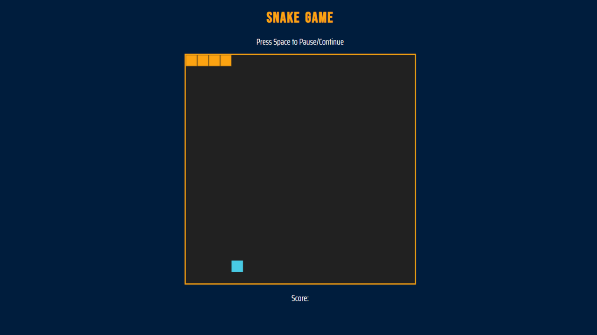

# SerpentCraft: A Web Game Powered by HTML, CSS, and JS

## Table of Contents

- [Links](#links)
- [Description](#description)
- [Screenshot](#screenshot)
- [Demo](#demo)
- [Features](#features)
- [Technologies Used](#technologies-used)
- [Usage](#usage)
- [What I Learned](#what-i-learned)
- [Contributing](#contributing)

## Links

- Solution URL: [GitHub Repository](https://github.com/aruntutter/snake-game)
- Live Demo: [Live Demo URL](https://peppy-puffpuff-da8145.netlify.app/)

## Description

SerpentCraft is a web-based Snake game developed using HTML, CSS, and JavaScript. It offers a classic gaming experience where players control a snake to collect food and grow in length while avoiding collisions with the game board boundaries and the snake's own body.

## Screenshot

## Demo

You can play the game online by visiting the [Live Demo](https://peppy-puffpuff-da8145.netlify.app/) hosted on our website.

## Features

- Classic Snake gameplay with intuitive controls.
- Score tracking to monitor your performance.
- Responsive design for an enjoyable gaming experience on different devices.

## Technologies Used

- HTML: Used for structuring the game interface.
- CSS: Styled the game elements and provided a visually appealing design.
- JavaScript: Implemented game logic and interactivity.

## Usage

To play SerpentCraft, follow these simple steps:

1. Open the [Live Demo](https://peppy-puffpuff-da8145.netlify.app/) in your web browser.
2. Use the arrow keys on your keyboard to control the direction of the snake.
3. Collect the food items to increase your score.
4. Avoid running into the game board boundaries and the snake's own body.
5. Have fun and try to achieve the highest score!

<!--  -->

## What I Learned

While working on this project, I learned:

- How to create a simple game using HTML5 canvas.
- Implementing game mechanics such as collision detection.
- Improving user experience through responsive design.
- Enhancing JavaScript skills for game development.

## Contributing

I welcome contributions to this project! If you have any suggestions for improvements, bug reports, or want to contribute new features, please open an issue or create a pull request on the [GitHub Repository](https://github.com/your-username/your-repo). Let's make SerpentCraft even better together!
